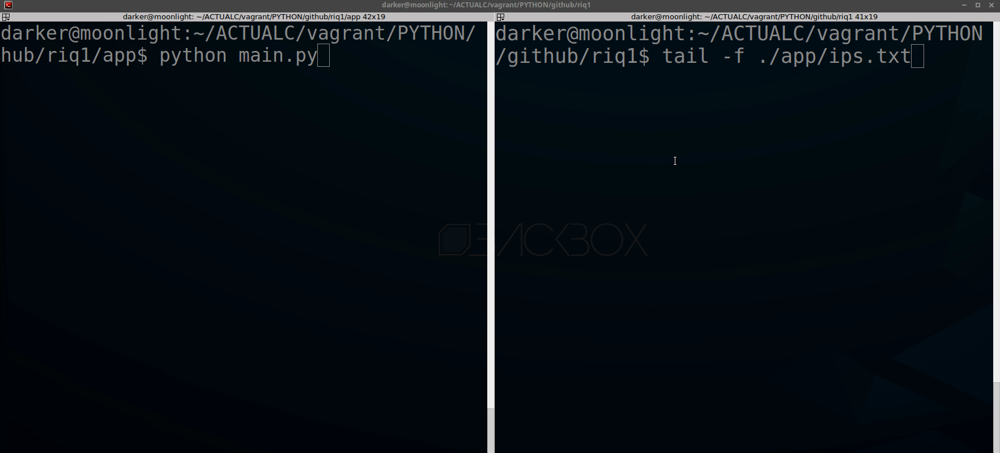
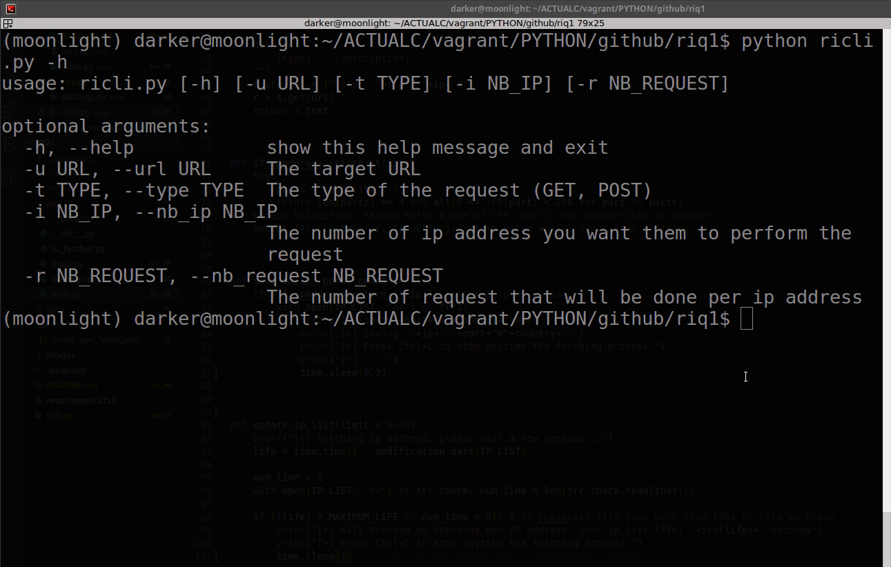

# Riq1

Change your ip address for each request you make ! Simple, Smart, Clear !

**NB: This program is for learning only, am not responsible of the bad use of it !**


## Requirements

- python (3.x is recommended)


## How to install

You just have to run:

```shell
# We install requirements
pip install -r requirements.txt
```

## How it works

When the main script it launched,
it check first the ip_list if the file is too old (here i configured 100s, you can change it later in ./app/settings.py), if it's need to fetch news ip proxy then it will scrap them online,
So after that the script use the session of the concerned ip proxy to emit te request.


## How to use it

### DEFAULT MODE

#### Usage

To use it you just have to run main.py and follow instructions
Just hit:

```shell
# We clone the project
git clone https://github.com/Sanix-Darker/riq1.git

# We browse to the project
cd path/to/the/project

python app/main.py
# Then follow instructions
```

#### Demo




### CLI MODE

#### Usage

How to use the cli mode:

```shell
$ python ricli.py -h
usage: ricli.py [-h] [-u URL] [-t TYPE] [-i NB_IP] [-r NB_REQUEST]

optional arguments:
  -h, --help            show this help message and exit
  -u URL, --url URL     The target URL
  -t TYPE, --type TYPE  The type of the request (GET, POST)
  -i NB_IP, --nb_ip NB_IP
                        The number of ip address you want them to perform the
                        request
  -r NB_REQUEST, --nb_request NB_REQUEST
                        The number of request that will be done per ip address

```

Example of usage:

```shell
python ./ricli.py -u http://example.com -i 5 -r 1
```

#### Demo



## MIT LICENSE


## Author

- Sanix-darker